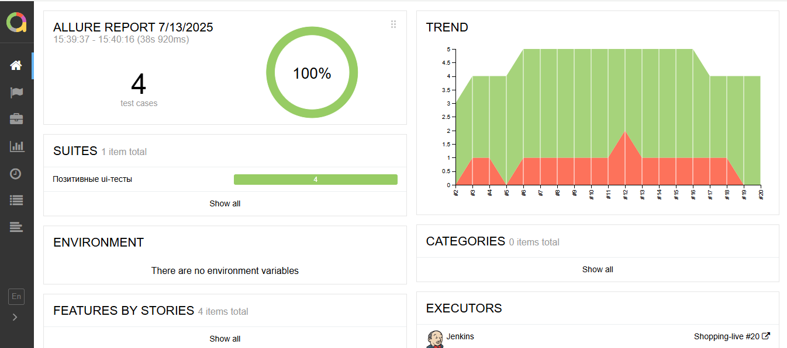

# Проект для автоматизации тестирования для интернет-магазина [Shopping Live](https://www.shoppinglive.ru/)

> Shopping Live — это популярный российский онлайн-магазин, сочетающий шопинг с развлекательным видеоформатом.
> 
> 
>## **Содержание:**

* <a href="#tools">Технологии и инструменты</a>

* <a href="#cases">Тестовые сценарии</a>

* <a href="#jenkins">Сборка в Jenkins</a>

* <a href="#console">Запуск из терминала</a>

* <a href="#allure">Allure отчет</a>

* <a href="#telegram">Уведомление ботом в Telegram о сборке</a>

* <a href="#video">Видео выполнения теста в Selenoid</a>


<a id="tools"></a>
## <a name="Технологии и инструменты">**Технологии и инструменты:**</a>

<p align="center">  
<a href="https://www.jetbrains.com/idea/"></a>  
<a href="https://www.java.com/"></a>  
<a href="https://github.com/"></a>  
<a href="https://junit.org/junit5/"></a>  
<a href="https://gradle.org/"></a>  
<a href="https://selenide.org/"></a>  
<a href="https://aerokube.com/selenoid/"></a>  
<a href="https://github.com/allure-framework/allure2"></a>
<a href="https://www.jenkins.io/"></a> 
<a href="https://web.telegram.org/"></a>  


</p>

- **IntelliJ IDEA**: Среда разработки для написания кода.
- **Java**: Jсновной язык автотестов.
- **GitHub**: Платформа для хостинга и совместной разработки кода.
- **JUnit 5**: Фреймворк для написания и выполнения тестов.
- **Gradle**: Система сборки проектов.
- **Selenide**: Удобный фреймворк для UI-тестов на Selenium.
- **Selenoid**: Инструмент для управления браузерами в контейнерах.
- **Allure**: Визуализация отчётов о тестировании.
- **Jenkins**: CI/CD для автоматического запуска тестов.
- **Telegram**: Мессенджер для уведомлений о сборке проекта.


<a id="cases"></a>
## <a name="Тестовые сценарии">**Тестовые сценарии:**</a>

-  Проверка поисковика на сайте
-  Проверка добавления товара в избранное
-  Проверка онлайн трансляции ТВ
-  Проверка добавления товара в корзину и создания быстрого заказа


<a id="jenkins"></a>
## </a><a name="Сборка"></a>Сборка в [Jenkins](https://jenkins.autotests.cloud/job/Kod3ik_qa_guru_x5/)</a>
Jenkins используется для автоматизации сборки и тестирования проекта. Он позволяет любому члену команды запускать тесты в любое время.
<p align="center">  
<a href="https://jenkins.autotests.cloud/job/Shopping-live"></a>  
</p>

### **Параметры сборки в Jenkins:**

- browser – браузер, по умолчанию chrome
- browserSize – размер окна браузера, по умолчанию 1920x1080
- remoteUrl – логин, пароль и адрес удаленного сервера Selenoid

<a id="console"></a>
## Команды для запуска из терминала

***Локальный запуск:***
```bash  
gradle clean regression -DbrowserSize="1920х1080" -Dbrowser="chrome"

```

***Удаленный запуск в Jenkins:***
```bash  
clean
regression_test
"-DremoteUrl=${REMOTE_URL}"
"-Dbrowser=${BROWSER}"
"-DbrowserVersion=${BROWSER_VERSION}"
"-DbrowserSize=${BROWSER_SIZE}"
```


<a id="allure"></a>
## </a> <a name="Allure"></a>Allure [отчет](https://jenkins.autotests.cloud/job/Shopping-live/20/allure/)</a>

Allure используется для генерации подробных отчетов о тестировании. Он предоставляет информацию о результатах тестов, включая графики и диаграммы, что помогает анализировать качество продукта и выявлять проблемные области.
### Главная страница

<p align="center">  
  
</p>

### Пример теста

  <p align="center">  

</p>

### Графики

  <p align="center">  

</p>


<a id="telegram"></a>
## </a> Уведомление ботом в Telegram о сборке
Настроены уведомления в Telegram для получения информации о статусе сборки и тестирования.

<p align="center">  
  
</p>


<a id="video"></a>
## </a> Видеозаписи выполнения тестов в Selenoid
Помогают визуально проверять, как проходят тесты и выявлять проблемы.

<p align="center">
   
</p>